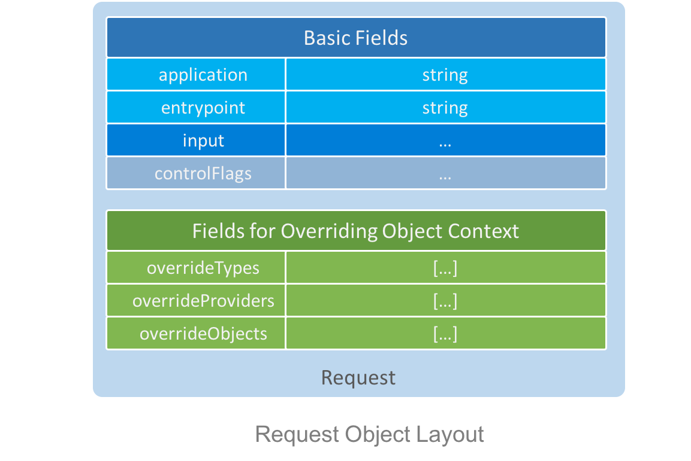

# Request

`Request` is a plain JavaScript object to describe requests sent to an `Application`.

It's defined by [JSON schema](../../schema/request.schema.json) or interface [`Request`](../../lib/wire.ts):

```ts
/// <summary> Interface for control flags. </summary>
export type ControlFlags = {
    /// <summary> Enable debugging or not. Set to false by default. </summary>
    debug?: boolean;

    /// <summary> Return performance numbers or not. Set to false by default. </summary>
    perf?: boolean;
}

/// <summary> Interface for winery request. </summary>
export interface Request {
    /// <summary> Registered application instance name </summary>
    application: string;

    /// <summary> Entry point name </summary>
    entryPoint: string;

    /// <summary> Trace ID </summary>
    traceId?: string;

    /// <summary> User input as the 1st argument passing to entry point function </summary>
    input?: any;

    /// <summary> Control flags </summary>
    controlFlags?: ControlFlags;

    /// <summary> Overridden types </summary>
    overrideTypes?: objectModel.TypeDefinition[];

    /// <summary> Overridden named objects </summary>
    overrideObjects?: objectModel.NamedObjectDefinition[];

    /// <summary> Overridden providers </summary>
    overrideProviders?: objectModel.ProviderDefinition[];
}
```
There are two groups of fields in `Request`: 
- Basic fields that describes request destination and input of service method
- Fields that define request level ObjectContext to override request template level or application level ObjectContext.


## Basic Fields
| Property name |  Required | Description                                                 |
|---------------|-----------|-------------------------------------------------------------|
| application   | Y         | Application instance name (or alias) to request for service |
| entrypoint    | Y         | Name of the entrypoint object to request for service        |
| input         | N         | User object as input that will be passed to entrypoint function, whose schema is entrypoint specific |
| controlFlags  | N         | Flags for enabling debugging and instrumentation |
 
## Override Fields
Further, object creation and object retrieval behaviors can be overriden from request with properties with prefix *"override"*. 

| Property name     | Required | Description |
|-------------------|----------|-------------|
| overrideTypes     | N        | override constructor of objects created [from plain JavaScript object](./object-context.md#from-plain-javascript-object) |
| overrideProviders | N        | override provider of objects created [from URI](./object-context.md#from-uri) |
| overrideObjects   | N        | override [named objects](./object-context.md#named-object) |


## Examples

Example 1: a simple request with only application / entryPoint.
```ts
{
    application: "example",
    entryPoint: "keepAlive"
}
```

Example 2: a request for summing a list of numbers.
```ts
{
    application: "math",
    entryPoint: "sum",
    input: [1, 2]
}
```

Example 3: a request that override an entry point.
```ts
{
    application: "example",
    entryPoint: "echo",
    input: "hello",
    overrideObjects: [
        {
            "name": "echo",
            "value": {
                "_type": "EntryPoint",
                "function": "function(input) { return input + ', winery'; }"
            }
        }
    ]
}
```

Example 4: a request that override an object creator.
```ts
{
    application: "example",
    entryPoint: "echo",
    input: "hello",
    overrideTypes: [
        {
            "typeName": "Document",
            "moduleName": "some-doc",
            "functionName": "create"
        }
    ]
}
```


Example 5: a request that override an object provider.
```ts
{
    application: "example",
    entryPoint: "echo",
    input: "hello",
    overrideProviders: [
        {
            "protocol": "ftp",
            "moduleName": "ftp-client",
            "functionName": "get"
        }
    ]
}
```

Example 6: returning debug information and performance information.
```ts
{
    application: "example",
    entryPoint: "doSomething",
    controlFlags: {
        debug: true,
        perf: true
    }
}
```